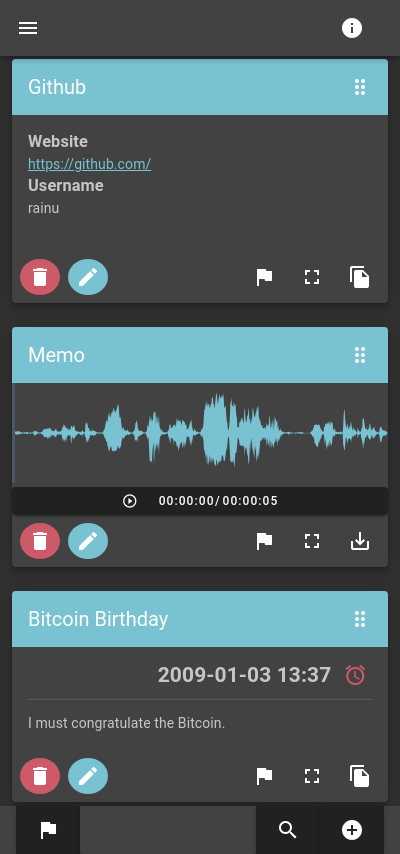

# DevNotes

> A progressive web application (PWA) for notes that **is fun**!

## DEMO

[Try it out!](https://rainu.github.io/dev-notes/)

[](https://rainu.github.io/dev-notes/) [](https://rainu.github.io/dev-notes/) [](https://rainu.github.io/dev-notes/)

[](https://rainu.github.io/dev-notes/#/notes/new/text) [](https://rainu.github.io/dev-notes/#/backup/)

## Features
* **Serverless** note app (no server or database required)
    * The whole content will be **stored locally**
* Support for full **encryption**
    * Data can be stored encrypted
* Different Note-Types for better user experience:
    * Textual
    * Markdown
    * Reminder
    * Image
    * Photo
    * Credentials
    * Template - text with customizable placeholder
* Filter your notes easily by using **tags**
* Customizable boards
    * a board is a user-predefined set of filters
* **Copy** your note-content **to clipboard**
* Multilingual
    * english
    * german
* Responsive - looks great on mobile and desktop
* 2 different themes:
    * dark
    * light
* Backup-Mechanisms
    * Download/Upload file
    * Download/Upload from [AWS S3](https://aws.amazon.com/s3/)
    * Download/Upload from [gist](https://gist.github.com/)
    * Download/Upload from [dropbox](https://www.dropbox.com/)
    * Download/Upload via [WebDAV](http://www.webdav.org/)
        * [Nextcloud](https://nextcloud.com/) ¹
        * [ownCloud](https://owncloud.org/) ¹
        * ...

¹ These services will work if CORS is correctly configured to return the proper headers. This may not work by default.

## How to install application

### Desktop
1. Open Chrome
1. Navigate to [DevNotes](https://rainu.github.io/dev-notes/)
1. Tap Add to home screen

### Android
1. Open Chrome
1. Navigate to [DevNotes](https://rainu.github.io/dev-notes/)
1. At the top right, click More (three dots)
1. Click "Install DevNotes ..."

## Quickstart for developer

``` bash
# install dependencies
$ npm install

# serve with hot reload at localhost:3000
$ npm run dev

# generate static project for production
$ npm run generate
```

For detailed explanation on how things work, check out [Nuxt.js docs](https://nuxtjs.org).

## Changelog

Have a look at the [changelog](CHANGELOG.md)

## License

MIT, see [LICENSE](LICENSE).
